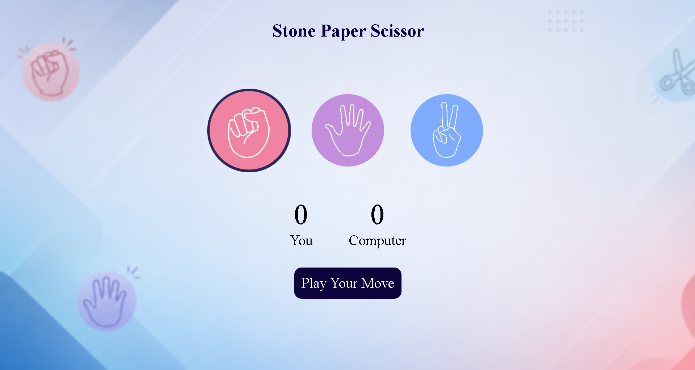
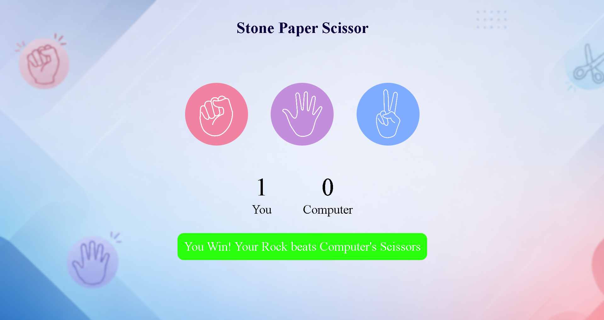
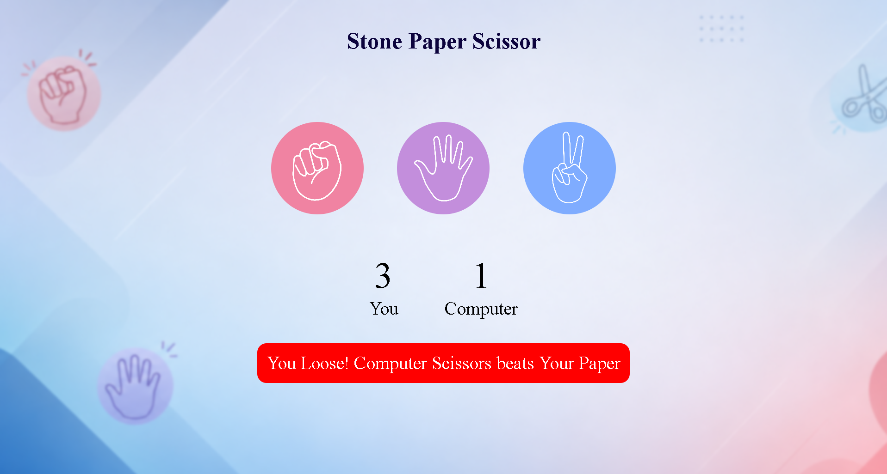
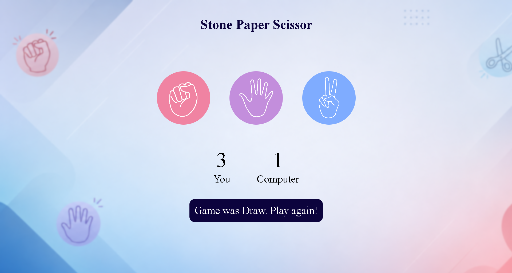

# ✊✋✌️ Rock Paper Scissor Game

A modern, responsive, and interactive **Rock Paper Scissor** game built using **HTML, CSS, and JavaScript**. Challenge the computer, test your luck, and enjoy a clean user interface with real-time score tracking and smooth gameplay.

## 🌐 Live Demo

🔗 **Live Website:**  
https://aniketsinghh11.github.io/Rock-Paper-Scissor-Game/

🔗 **GitHub Repository:**  
https://github.com/aniketsinghh11/Rock-Paper-Scissor-Game

---

# 📸 Screenshots

### 🏠 Home Screen

<p align="center">
  
</p>

### 🎮 User Win

<p align="center">
  
</p>

### 🎮 Computer Win

<p align="center">
  
</p>

### 🏆 Draw Result

<p align="center">
  
</p>

---


# ✨ Features

- ✊ Choose Rock, Paper, or Scissor
- 🤖 Play against the Computer
- 🎲 Random Computer Move Generation
- 🏆 Instant Win, Lose & Draw Detection
- 📊 Live Score Tracking
- 🎯 Displays Both Player & Computer Choices
- ⚡ Dynamic Result Messages
- 🔄 Unlimited Gameplay
- 🎨 Modern & Minimal User Interface
- ✨ Smooth Hover Animations
- 🌐 Hosted on GitHub Pages

---

# 🛠️ Built With

- HTML5
- CSS3
- JavaScript (ES6)

---

# 📂 Project Structure

```text
Rock-Paper-Scissor-Game/
│── images/
│── index.html
│── style.css
│── script.js
│── README.md
```

---

# 🚀 Getting Started

### Clone the repository

```bash
git clone https://github.com/aniketsinghh11/Rock-Paper-Scissor-Game.git
```

### Run the project

Simply open the **index.html** file in your browser.

---

# 🎮 Game Rules

- 🪨 Rock beats Scissor
- 📄 Paper beats Rock
- ✂️ Scissor beats Paper
- 🤝 Same choices result in a Draw

---

# 🎯 Future Improvements

- 🔊 Sound Effects
- 🎵 Background Music
- 🌙 Dark / Light Theme
- 📈 Match History
- 🏅 Best Score Tracker
- 🧠 Multiple Difficulty Levels
- 🌍 Online Multiplayer

---

# 🙋‍♂️ Author

### **Aniket**

🐙 GitHub: https://github.com/aniketsinghh11

---

# ⭐ Support

If you enjoyed this project, consider giving it a ⭐ on GitHub!

Your support motivates me to build more exciting web development projects.

---

# 📄 License

This project is licensed under the **MIT License**.
